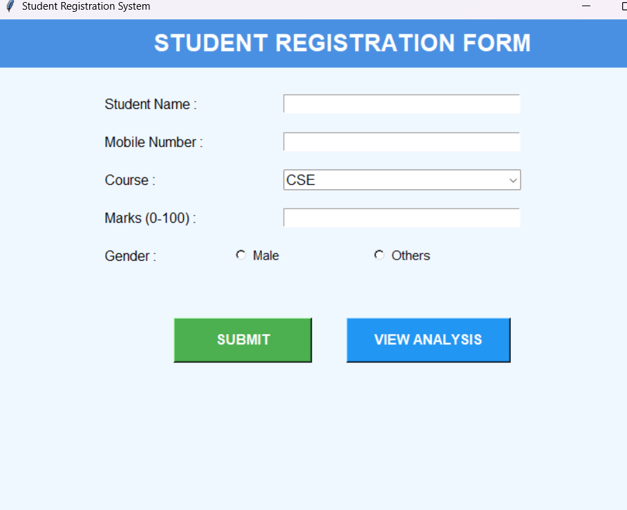

# Student Registration System

A simple, user-friendly **Student Registration Form** built using **Python Tkinter** with data storage in CSV and visual marks analysis using **Matplotlib**.

Perfect for school/college mini projects, record keeping, or learning GUI programming.

---

### Features

- Clean and beautiful GUI
- Register students with Name, Mobile, Course, Marks, and Gender
- Full input validation (10-digit mobile, marks 0–100, all fields required)
- Data saved automatically in `students_data.csv`
- View **Scatter Plot Analysis** of student marks
- Gender options: Male, Female, Others (all clearly visible)
- Form clears automatically after submission
- Works without internet

---

### Screenshot


*(Add a screenshot of your app by taking a photo and placing it as `screenshot.png` in the folder)*

---

### Requirements

- Python 3.6 or above
- Libraries (comes with Python by default):
  - `tkinter`
  - `csv`
  - `os`
  - `matplotlib`

> No need to install anything extra if you have Python installed!

---

### How to Run

1. Save the code as `student_registration.py`
2. Open terminal or command prompt
3. Run the program:

```bash
python student_registration.py